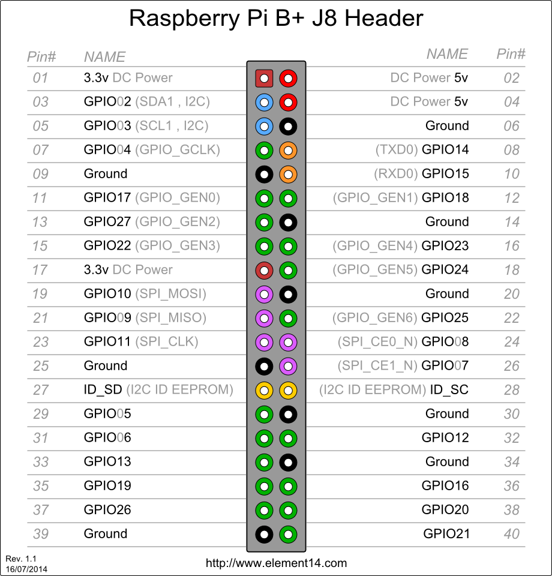

# fool bot
傻瓜机器龟-树莓派控制代码

## 用法
将舵机控制板pca9685与树莓派GPIO口连接,使用SDA1,SCL1

命令行运行
``` 
python main.py
``` 

## 文件功能描述
* main.py 主文件
* 控制模块
    * motion.py 机器动作控制
    * pca9685.py 16路舵机控制板pca9685
    * I2C.py I2c(Inter－Integrated Circuit)库
    * smbus.py SMBus(System Management Bus,系统管理总线)库
* 数据传输模块
    * mqttController.py mqtt即时通讯协议库

## 资料
